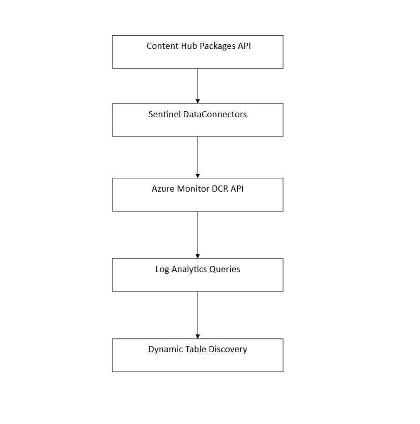
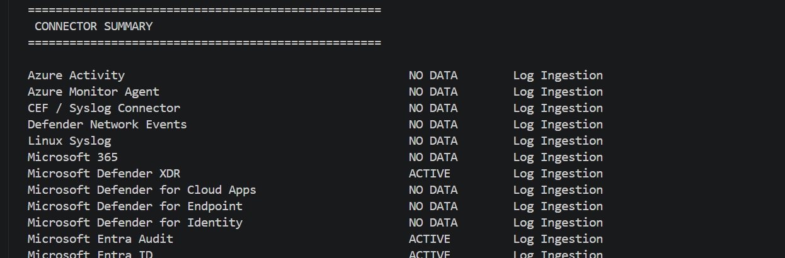

# Microsoft Sentinel Connector Status Monitor

A comprehensive Python-based utility for discovering, auditing, and verifying the operational status of data connectors in Microsoft Sentinel. This tool provides a "Single Source of Truth" by correlating data from four independent sources: legacy APIs, Content Hub packages, Data Collection Rules (DCR), and live log ingestion telemetry.

---

##  Table of Contents

- [Overview](#overview)
- [Prerequisites](#prerequisites)
- [Quick Start](#quick-start)
- [Configuration](#configuration)
- [How It Works](#how-it-works)
- [Connector Status Types](#connector-status-types)
- [Architecture & APIs](#architecture--apis)
- [Azure Permissions](#azure-permissions)
- [Authentication](#authentication)
- [Features](#features)
- [Troubleshooting](#troubleshooting)
- [References](#references)

---

## Overview

Tracking active data ingestion in Microsoft Sentinel is challenging because modern Sentinel no longer centralizes connector information through a single API. This tool aggregates data from **four distinct sources**:

1. **Legacy Connectors API** - Standard built-in connectors
2. **Content Hub** - Solutions and connectors installed via Content Hub
3. **DCR / AMA** - Azure Monitor Agent and Data Collection Rule configurations
4. **Live Log Analysis** - Real-time ingestion verification and health metrics

The script uses **Priority Scoring Logic** to intelligently merge duplicates and present the healthiest status for each connector.

---

## Prerequisites

- **Python**: 3.8 or higher
- **Azure Permissions**: At minimum, Sentinel Reader and Log Analytics Reader roles
- **Required Libraries**:
  ```bash
  pip install azure-identity azure-monitor-query requests
  ```

---

## Quick Start

1. **Install dependencies**:
   ```bash
   pip install -r requirements.txt
   ```

2. **Configure your environment** (see [Configuration](#configuration) section)

3. **Run the script**:
   ```bash
   python connector_sentinel.py
   ```

4. **Review the output** for connector status summary and health metrics

---

## Configuration

Update the `CONFIGURATION` section in your script with your Azure environment details:

```python
TENANT_ID = "your-tenant-id"
SUBSCRIPTION_ID = "your-subscription-id"
RESOURCE_GROUP = "your-resource-group"
WORKSPACE_NAME = "your-workspace-name"
WORKSPACE_ID = "your-log-analytics-guid"
```

**Where to find these values:**
- Azure Portal → Your Workspace → Overview
- Log Analytics Workspace → Workspace ID (also called GUID)
- Subscription details in Azure Portal

---

## How It Works

### Priority Scoring System

The script uses a priority scoring system to handle connectors appearing in multiple data sources. Each connector is assigned a score based on its healthiest detected status:

| Priority | Status | Score | Definition |
|----------|--------|-------|-----------|
| Highest | ACTIVE | 5 | Data received within the last 60 minutes |
| High | INSTALLED | 4 | Connector present but no recent activity |
| Medium | CONFIGURED | 3 | DCR or configuration exists |
| Low | NO DATA | 2 | Table exists but empty for lookback period |
| Lowest | UNKNOWN | 1 | Status could not be determined |

### Types of Connectors Detected

The script monitors:
- Active connectors
- Installed connectors
- Legacy connectors
- AMA/DCR connectors
- Content Hub connectors
- Custom/Codeless connectors
- Stale connectors (no recent data)

---

## Connector Status Types

| Status | Description | Implication |
|--------|-------------|------------|
| **ACTIVE** | Actively ingesting data |  Connector is working properly |
| **STALE** | No data for 60+ minutes |  Possible connection issue |
| **NO DATA** | Configured but no ingestion |  Check source or configuration |
| **INSTALLED** | Installed but inactive | ℹ May be standby or not yet configured |
| **CONFIGURED** | DCR exists | ℹ Ready for use |
| **UNKNOWN** | Cannot determine status |  Requires investigation |

---

## Architecture & APIs

### Data Sources

| Source | Purpose | Use Case |
|--------|---------|----------|
| **Sentinel Data Connectors API** | Legacy connector status | Built-in connectors, push connectors, SAP |
| **Content Hub Packages API** | Installed solutions | Content Hub and Codeless connectors |
| **Azure Monitor DCR API** | AMA configurations | Event collection rules and syslog pipelines |
| **Log Analytics Query API** | Live ingestion detection | Active health monitoring |
| **Dynamic Table Discovery** | Custom log detection | `_CL` tables and third-party sources |

### API Endpoints

**1. Microsoft Sentinel Data Connectors API**
```
GET /Microsoft.SecurityInsights/dataConnectors
```

**2. Microsoft Sentinel Content Packages API**
```
GET /Microsoft.SecurityInsights/contentPackages
```

**3. Azure Monitor Data Collection Rules API**
```
GET /Microsoft.Insights/dataCollectionRules
```

**4. Azure Monitor Logs Query API**
```
KQL: search * | summarize LastLog=max(TimeGenerated) by $table
```

### Architecture Diagram



---

## Features

### 🔍 Dynamic Discovery
Automatically detects:
- Custom logs (tables ending in `_CL`)
- Third-party tables (CrowdStrike, Prisma, WAF)
- Codeless connectors
- Custom ingestion pipelines

### ⏱️ Stale Data Detection
Flags connectors with no data ingestion for 60+ minutes, helping identify:
- Inactive sources
- Network connectivity issues
- Configuration problems

### 🔗 DCR Mapping
Specifically identifies and maps Azure Monitor Agent (AMA) configurations and data collection rules.

---

## Azure Permissions

### Required RBAC Role

Assign the following role to your user account:

| Role | Purpose |
|------|---------|
| **Microsoft Sentinel Reader** | Read Sentinel resources and connectors |
| **Log Analytics Reader** | Query workspace logs and tables |

### API Permissions (for Service Principal)

| API | Permission | Required |
|-----|-----------|----------|
| **Log Analytics API** | Data.read |  Yes |
| **Microsoft Sentinel API** | SecurityInsights.Read |  Yes |
| **Microsoft Graph** | Directory.Read.All |  Optional |
| **Microsoft Graph** | AuditLog.Read.All |  Optional |

---

## Authentication

The script uses **InteractiveBrowserCredential()** for authentication.

### How it works:
1. Script initiates authentication request
2. Browser opens with Azure login page
3. Enter your Azure credentials
4. Authentication token is obtained
5. Script queries Sentinel and Log Analytics

### Requirements:
- You must have **Microsoft Sentinel Reader** role
- You must have **Log Analytics Reader** role
- Credentials will be cached locally (browser-based flow)

---

## Example Output

### Connector Summary


### Sample Results

```
Microsoft Entra ID          => ACTIVE 
CrowdStrike Falcon          => ACTIVE 
Windows Firewall            => NO DATA 
Syslog (AMA)                => CONFIGURED ℹ
Custom Application Logs     => STALE 
```

### Interpreting Results

**ACTIVE** - Connector is functioning normally and sending data consistently.

**NO DATA** - Connector is configured but not receiving data. Possible causes:
- Source not yet onboarded
- Connector recently installed (needs time)
- No activity from source
- Diagnostic settings not enabled
- Firewall/network restrictions

**STALE** - Last data received 60+ minutes ago. Possible causes:
- Temporary network issue
- Source system downtime
- Log collection delayed
- Volume reduction in source

---

## Dynamic Table Discovery

The script uses the following KQL query to discover all tables and detect last ingestion time:

```kusto
search *
| summarize LastLog = max(TimeGenerated) by $table
```

This discovers:
-  Built-in tables
-  Custom `_CL` tables
-  Third-party connector tables
-  Codeless connector tables

---

## Important Notes

### Modern Sentinel Architecture

Modern Microsoft Sentinel has evolved to distribute connector management across multiple systems:

**Legacy approach (deprecated)**:
- All connectors in `/dataConnectors` endpoint

**Modern approach (current)**:
- **Content Hub** - Solutions and managed connectors
- **AMA / DCRs** - Agent-based collection
- **Codeless Connector Framework** - Code-free connectors
- **Custom Pipelines** - Custom integrations

### Enterprise Monitoring Strategy

To achieve complete visibility, combine:
-  ARM template APIs
-  DCR APIs
-  Log Analytics queries
-  Dynamic table discovery

---

## Troubleshooting

###  Error: 403 AuthorizationFailed

**Solution:**
1. Verify you have assigned roles:
   - Microsoft Sentinel Reader
   - Log Analytics Reader
   - (Optional) Monitoring Reader
2. Refresh your credentials using the browser login
3. Clear cached credentials if using service principal

###  NO DATA for All Connectors

**Possible causes:**
- No data ingested yet (new workspace)
- Connector recently installed
- No activity from sources
- Diagnostic settings not enabled
- Insufficient onboarded devices

**Verify:**
1. Check Azure Portal → Log Analytics Workspace → Logs
2. Run test KQL query: `search * | take 1`
3. Verify diagnostic settings are enabled on sources

###  Partial Results / Missing Connectors

**Causes:**
- Incomplete permissions
- Workspace not fully provisioned
- Service principal lacks API permissions

**Solution:**
1. Verify Log Analytics Reader and Sentinel Reader roles
2. Wait 5-10 minutes after role assignment
3. Re-run the script
4. Check Azure Portal logs for permission errors

###  Script Timeout

**Solution:**
- Increase workspace size or reduce lookback period
- Run query during off-peak hours
- Filter to specific connector types
- Check network connectivity

---

## References

- [Microsoft Sentinel Documentation](https://learn.microsoft.com/en-us/azure/sentinel/)
- [Sentinel Tables & Connectors Reference](https://learn.microsoft.com/en-us/azure/sentinel/sentinel-tables-connectors-reference)
- [Connecting Data Sources](https://learn.microsoft.com/en-us/azure/sentinel/connect-data-sources?tabs=defender-portal)
- [Sentinel API 101](https://techcommunity.microsoft.com/blog/microsoftsentinelblog/microsoft-sentinel-api-101/1438928)
- [Security Insights REST API](https://learn.microsoft.com/en-us/rest/api/securityinsights/)
- [Azure Monitor DCR Documentation](https://learn.microsoft.com/en-us/azure/azure-monitor/essentials/data-collection-rule-overview)

---

## Support

For issues or questions:
1. Review the [Troubleshooting](#troubleshooting) section
2. Check Azure Audit logs in the Portal
3. Verify workspace configuration
4. Review script logs for detailed error messages